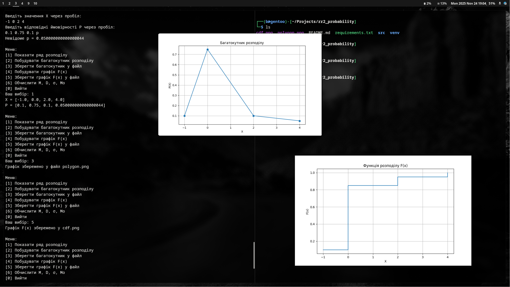

# rr2_probability

**rr2_probability** - програма для виконання всіх підзавдань завдання 1 розрахункової роботи №2 з теорії ймовірностей. Реалізовано введення ряду розподілу, пошук невідомого `p`, побудова графіків і
обчислення числових характеристик.
Написав **Палійчук Владислав Вікторович** з групи **ТВ-43**.



## Функціональність

- Введення значень X та ймовірностей P  
- Підтримка введення `p` як невідомого значення  
- Автоматичне обчислення `p`  
- Багатокутник розподілу (показати або зберегти у файл)  
- Функція розподілу F(x) (показати або зберегти)  
- Математичне сподівання, дисперсія, стандартне відхилення, мода

## Структура проєкту

```.
├── README.md
├── requirements.txt
└── src
    ├── distrib
    │   ├── cdf.py
    │   ├── findP.py
    │   ├── input.py
    │   ├── polygon.py
    │   └── stats.py
    ├── __init__.py
    ├── main.py
    └── utils
        └── menu.py
```

## Запуск

### 1. Клонувати Git репозиторій
```bash
git clone git@github.com:paliichukvladyslav/rr2_probability.git
cd rr2_probability
```
### 2. Створити та активувати virtual environment
На GNU/Linux:
```bash
python -m venv venv
source venv/bin/activate
```
На MS Windows (Powershell):
```bash
python -m venv venv
. .\venv\Scripts\Activate.ps1
```
### 3. Встановити залежності
```pip install -r requirements.txt```
### 4. Запустити програму
```python src/main.py```
# Приємного використання!
